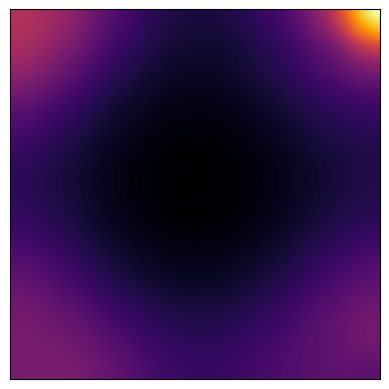
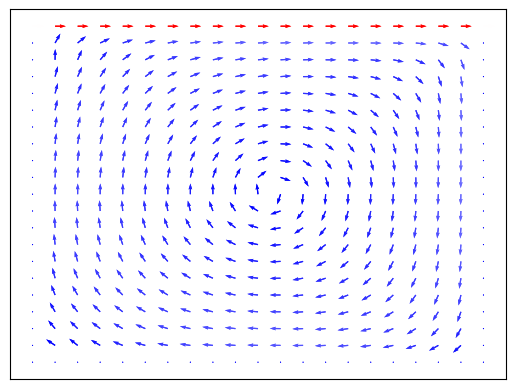
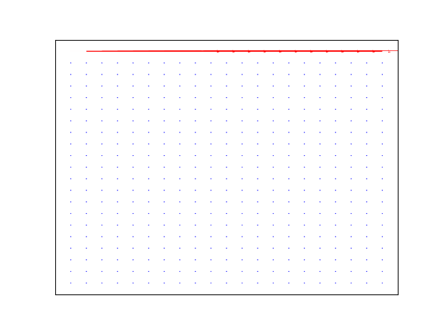

```python
import itertools
import glob
import os
from pathlib import Path

import meshio
import numpy as np
import matplotlib.pyplot as plt
import scipy as sp
from celluloid import Camera
from IPython.display import HTML, Image

import ofiz.plot as ofiz

ROOT = Path("./assets/img/")

if not os.path.exists(ROOT):
    os.makedirs(ROOT)
```


```python
vtk_path = "VTK/cavity_2000.vtk"

mesh = meshio.read(vtk_path)
```

# Pressure


```python
ofiz.plot_heatmap(mesh=mesh, field=mesh.point_data["p"], resolution=(128, 128, 2), sigma=2.5)
```


    <Axes: >


    

    


```python
def plot_fn(mesh, ax):
    mesh = ofiz.MeshGraphics(mesh)
    mesh.plot_heatmap(field_name="p", field_type="point", resolution=(128, 128, 2), sigma=2.5, ax=ax)

ofiz.animate("./VTK", plot_fn, gif_path=ROOT / "p_heatmap.gif", fps=10)
```


# Velocity


```python
ofiz.plot_quiver(mesh, field=mesh.point_data["U"])
```


    <Axes: >


    

    


```python
def plot_fn(mesh, ax):
    mesh = ofiz.MeshGraphics(mesh)
    mesh.plot_quiver(field_name="U", field_type="point", ax=ax)

ofiz.animate("./VTK", plot_fn, gif_path=ROOT / "u_quiver.gif", fps=10)
```





